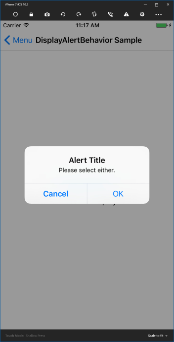

# DisplayAlertBehavior

Alertを表示し、ユーザー操作に対応するCommandを実行します。   
Alertの表示には、表示のトリガーと表示状態（タイトルやメッセージなど）の定義について、いくつかの方法を選択できます。  

1. 画面要素のイベントに応じてXAML上に定義された状態で表示する
2. コードからの要求に応じて表示する  
    1. XAML上に定義された状態で表示する  
    2. 表示状態をコードから詳細に指定する  

コマンドの詳細な実行仕様については、以下をご覧ください。  

* [Commandの実行仕様について](CommandExecutionSpecifation-ja.md)  

## 画面要素のイベントに応じてXAML上に定義された状態で表示する  

ユーザーのButtonなどのクリックなどの振る舞いに応じてAlertを表示し、Alert上のユーザー操作にもとづきCommandを実行します。  
Buttonのクリック時にAlertを表示する例を下に示します。  

```xml
<Button Text="Show Display Alert">
    <Button.Behaviors>
        <behaviorsPack:DisplayAlertBehavior
            EventName="Clicked"
            Title="Alert Title"
            Message="Please select either."
            Accept="OK"
            AcceptCommand="{Binding AcceptCommand}"
            Cancel="Cancel"
            CancelCommand="{Binding CancelCommand}"/>
    </Button.Behaviors>
</Button>
```

Buttonをクリックすると次のようなAlertが表示されます。  



## コードからの要求に応じて表示する  

（主に）ViewModel側のコードからの要求に応じてAlertを表示できます。  
このとき表示するAlertの状態（タイトルやメッセージなど）は、XAML上に全て定義する方法と、コード側から全てもしくは一部を指定して表示する方法のいずれかをとれます。

### XAML上に定義された状態で表示する  

コード側にNotificationRequestを定義し、必要時に要求をあげます。  
まずはコード側を見てみましょう。  

```cs
public NotificationRequest DisplayRequest { get; } = new NotificationRequest();

private void Foo()
{
    ...
    DisplayRequest.Raise();
}
```

このようにNotificationRequestをプロパティとして定義し、必要となった際にRaiseイベントを呼び出してAlertを表示します。  
XAML側では、先程はEventNameを指定していましたが、こちらはNotificationRequestプロパティへ、前で定義されたDisplayRequestをバインドします。  
こうすることで、DisplayRequest.Raise()の呼び出し時に、XAMLの定義に従ってActionSheetが表示されます。

```xml
<Button Text="Show Display Alert">
    <Button.Behaviors>
        <behaviorsPack:DisplayAlertBehavior
            NotificationRequest="{Binding DisplayRequest}"
            Title="Alert Title"
            Message="Please select either."
            Accept="OK"
            AcceptCommand="{Binding AcceptCommand}"
            Cancel="Cancel"
            CancelCommand="{Binding CancelCommand}"/>
    </Button.Behaviors>
</Button>
```

### コード側で表示をコントロールする  

DisplayAlertRequestを利用することで、コード側からActionSheetの表示状態を一部、もしくは全てをコントロールすることが可能です。  
実際に例を見てみましょう。  
コード側では次のようにDisplayAlertRequestを利用します。  

```cs
public DisplayAlertRequest DisplayRequest { get; } = new DisplayAlertRequest();

private void Foo()
{
    ...
	request.Raise(
        "Alert Title", 
        "Please select either.", 
        new AlertButton { Message = "OK", Action => () => {
            // OKクリック時の処理
            ...
        } }, 
        new AlertButton { Message = "Cancel", Action => () => {
            // Cancelクリック時の処理
            ...
        } });
}
```

そしてXAMLには、つぎのように記述します。  

```xml
<Button Text="Show Display Alert">
    <Button.Behaviors>
        <behaviorsPack:DisplayAlertBehavior
            NotificationRequest="{Binding DisplayRequest}"/>
    </Button.Behaviors>
</Button>
```

先ほどのXAMLで定義されたケースと同等のAlertが表示されます。  
動的にAlertの表示をコントロールしたい場合は、こちらの方法を利用すると良いでしょう。  

なお、XAML上でも各プロパティが指定されていた場合、DisplayAlertRequestの値が優先されてます。  
DisplayAlertRequest側でnullが指定されていて、XAML上で値が指定されている項目についてはXAML側の定義に従います。  
XAML上で定義されたDisplayAlertBehaviorの振る舞いの全て、もしくは一部をDisplayAlertRequestで変更することが可能です。  
